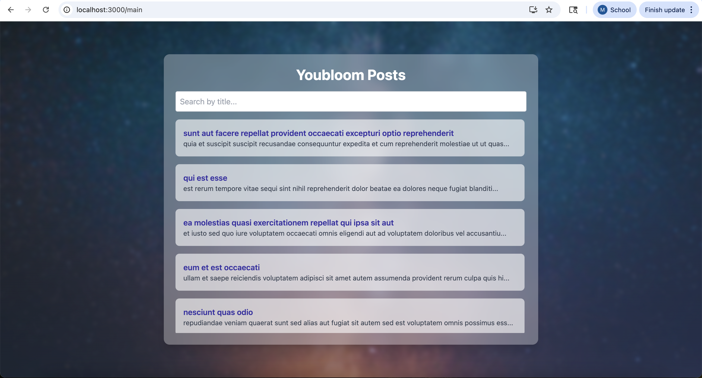

# React Demo App – Internship Assignment (Youbloom)

This is a fully functional React application developed as part of a technical interview task. The app features authentication, dynamic API integration, clean responsive design using Tailwind CSS, and a modular React architecture.

---

##  Features

- Login with phone number validation (+254 format)
- Main Page: Fetch and display posts from a public API
- Live search functionality to filter posts
- Detail Page: Show full post content with back navigation
- Responsive UI with a shared background across all pages
- One unit test implemented with React Testing Library
- Clean, modular folder structure

---

## Technologies Used

- React (CRA)
- React Router DOM
- Axios
- Tailwind CSS
- Jest + React Testing Library

---

## Getting Started

### 1. Clone the Repository

```bash
git clone https://github.com/John27052001/react-demo-app.git
cd react-demo-app

### 2. Install Dependencies

npm install

### 3. Run the Application

npm start

Visit http://localhost:3000 in your browser

## Login Credentials

Use this phone number to successfully log in:

+254712345678


Any other number will show a validation error.

---

## Running the Test

We’ve separated the validation logic into a utility file (`utils/validation.js`) to make it easier to test without needing router dependencies.

### Run the working unit test:

```bash
npm test src/utils/validation.test.js
```

### Cleanup Note:

To avoid errors from unnecessary test files, delete these:

```bash
rm src/pages/Login.test.js
rm src/pages/Login.validation.test.js
```

Only the passing unit test in `src/utils/validation.test.js` is needed..

---

## Project Structure

```
src/
├── components/
│   └── Layout.jsx          # Shared background wrapper
├── pages/
│   ├── Login.jsx
│   ├── Main.jsx
│   ├── Detail.jsx
│   └── Login.test.js
├── App.js                  # Main router
├── index.js
└── index.css               # Tailwind CSS
```

---

## Screenshots

```



```

---

## Submission

- All features implemented
- Code organized with reusable components
- Unit test included
- Background image applied across all pages
- Instructions provided in README
